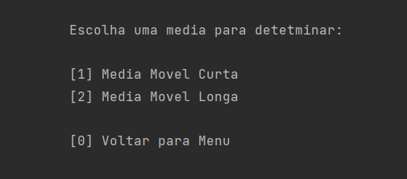

# Análise de séries temporais com indicativo de tendência baseado em média móvel

## Fornece uma análise de tendência (Alta, Queda, Constante) apartir de uma série de dados inserida pelo usuário


## Entrada do usuário:

- Serie de dados
- Valor da média movel Curta
- Valor da média movel Longa

## Saída do programa:

- Medias Moveis e Tendência calculados para cada dado na serie de entrada

Padrões de Commits inspirados na [coala API](https://api.coala.io/en/latest/Developers/Writing_Good_Commits.html)

## Fazendo sua primeira análise

### Os passos a seguir descrevem com exemplos o fluxo de funcionamento do programa, que consiste em:

1. Cadastrar uma Série
2. Configurar as Médias Movéis
3. Gerar uma análise

### Passo 1 - Cadastro de uma Série

Ao iniciar o programa você encontrará o seguinte menu:


Queremos começar cadastrando uma Serie de dados, 
então vamos selecionar a opção "Gerenciar Serie".
Para Selecionar a Opção digite ``1`` e pressione a tecla ```Enter```

Será exibido no terminal outro menu:


Para inserir os dados da série vamos selecione a opção 'Adicionar itens'.
Selecione essa opção digitando ``1`` seguido da tecla ```Enter```

Você entrará no Modo de Cadastro da Serie, 
para cadastrar uma serie digite, cada item seguido por ```Enter```. 

```
4.159
4.1293
4.0841
4.0556
4.1071
4.0954
4.1104
4.1095
4.1097
4.1293
```

Obs:  Valores em ponto flutuante ```float``` 
deverão ser inseridos usando ponto ```.``` ao invés da virgula ```,```
caso contrário o item não será cadastrado e 
será exibido na tela ```Valor invalido, tente novamente: ```

Para Sair do Modo de Cadastro da Serie, 
digite ```q``` seguido por ```Enter```

### Passo 2 - Configuração das Medias Movéis

No Menu inicial, selecione a opção "Gerenciar Medias Moveis", 
digitando ```2``` seguido por ```Enter```

Será exibido o menu:



Nesse exemplo vamos configurar a Média Movel Curta com o valor 3 
e a Média Movel Longa com 5.

Para definir o valor da Media Curta basta selecionar a opção Média Movel Curta,
digitando ```1``` seguido por ```Enter```

Digite o valor da Média, nesse caso 3

Repita o procedimento para a Média Movel Longa

### Passo 3 - Gerar Análise

No menu inicial, digite a opção correspondente a ```Gerar Saida```

Seguindo os passos anteriores teremos como resultado:


